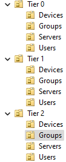
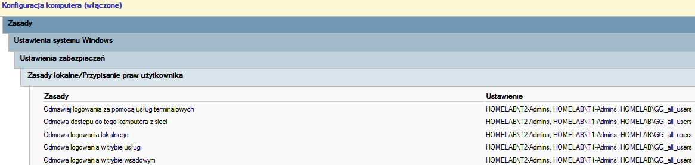
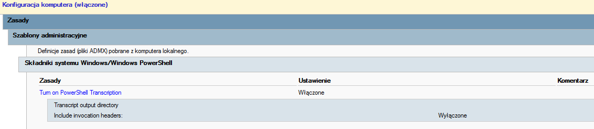
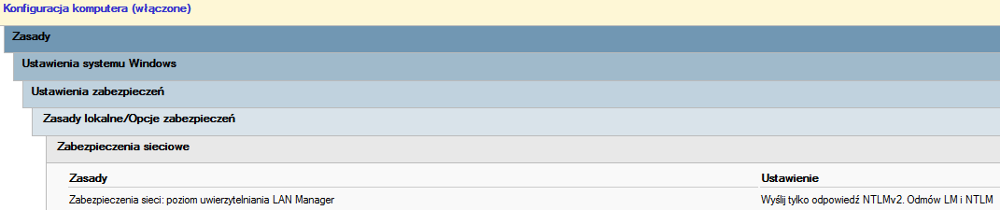
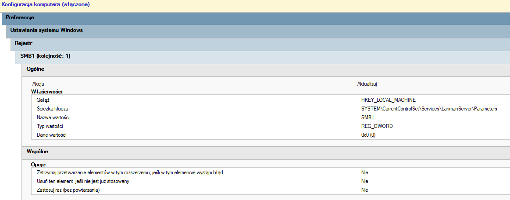

# Active Directory Test Environment

Active Directory environment to test, implement and document various features and improvements of Active Directory and Microsoft Entra ID

- [Administrative Security Model (Tiered Model)](#administrative-security-model-tiered-model)
- [LAPS](#laps)
- [Podsumowanie](#podsumowanie)

## Hardening:

### Administrative Security Model (Tiered Model)
- Tier 0: Domain controllers, key groups (Domain Admins, Enterprise Admins) and administrator accounts
- Tier 1: Application servers, databases, server administrator accounts
- Tier 2: User workstations, laptops, standard accounts, local administrators

Accounts and machines belonging to respective tiers are isolated from eachother by organisational units and group policies.

Grou policy object restricting access to T0 machines for T2-Admins, T1-Admins and GG_all_users groups (T1 and T2 restriction by analogy):

### LAPS 
Added LAPS functionality for easy management of workstation's local administrator password.

### Block PSv2

### Turn off NTLMv1

### Turn off SMBv1

